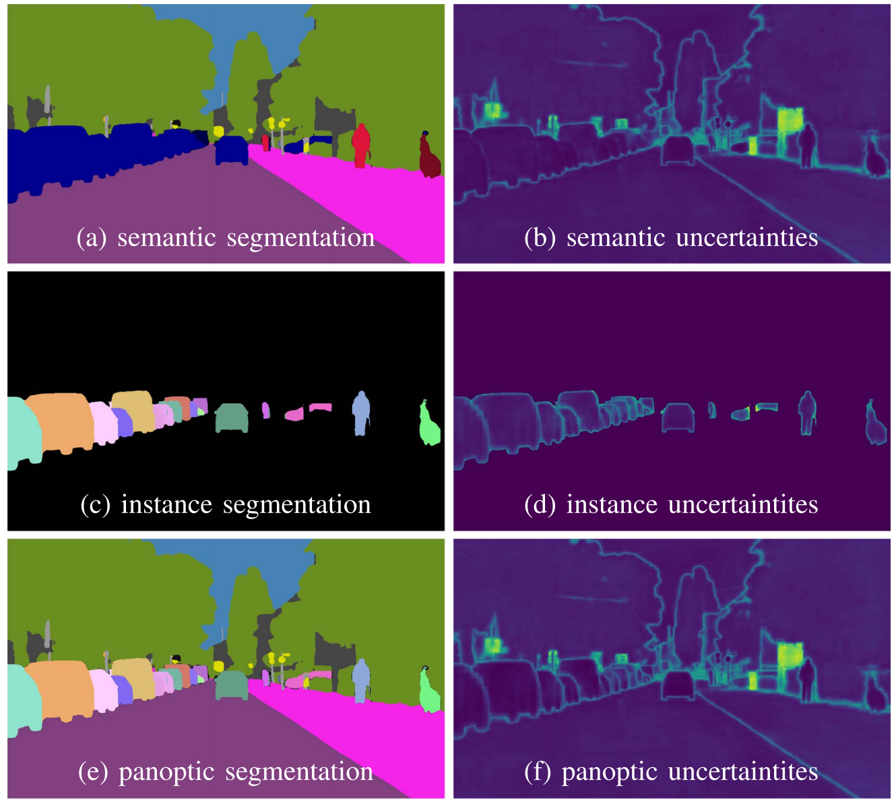

# EvPSNet: Evidential Panoptic Segmentation Network for Uncertainy-aware Panoptic Segmentation

test!!

EvPSNet is the first approach to tackle the task of uncertainty-aware panoptic segmentation, with an aim to provide per-pixel semantic and instance label together with per-pixel panoptic uncertainty estimation.



This repository contains the **PyTorch implementation** of our RAL'2023 paper [Uncertainty-aware Panoptic Segmentation](https://arxiv.org/abs/2206.14554). The repository builds on [EfficientPS](https://github.com/DeepSceneSeg/EfficientPS), [mmdetection](https://github.com/open-mmlab/mmdetection) and [gen-efficientnet-pytorch](https://github.com/rwightman/gen-efficientnet-pytorch) codebases.

If you find the code useful for your research, please consider citing our paper:
```
@article{sirohi2023uncertainty,
  title={Uncertainty-aware panoptic segmentation},
  author={Sirohi, Kshitij and Marvi, Sajad and B{\"u}scher, Daniel and Burgard, Wolfram},
  journal={IEEE Robotics and Automation Letters},
  volume={8},
  number={5},
  pages={2629--2636},
  year={2023},
  publisher={IEEE}
}
```

## System Requirements
* Linux 
* Python 3.7
* PyTorch 1.7
* CUDA 10.2
* GCC 7 or 8

**IMPORTANT NOTE**: These requirements are not necessarily mandatory. However, we have only tested the code under the above settings and cannot provide support for other setups.

## Installation
a. Create a conda virtual environment from the provided environment.yml and activate it.
```shell
git clone https://github.com/kshitij3112/EvPSNet.git
cd EvPSNet
conda env create -n EvPSnet_env --file=environment.yml
conda activate EvPSnet_env
```
b. Install all other dependencies using pip:
```bash
pip install -r requirements.txt
```
c. Install EfficientNet implementation
```bash
cd efficientNet
python setup.py develop
```
d. Install EvPSNet implementation
```bash
cd ..
python setup.py develop
```
## Prepare datasets
It is recommended to symlink the dataset root to `$EvPSNet/data`.
If your folder structure is different, you may need to change the corresponding paths in config files.

```
EvPSNet
├── mmdet
├── tools
├── configs
└── data
    └── cityscapes
        ├── annotations
        ├── train
        ├── val
        ├── stuffthingmaps
        ├── cityscapes_panoptic_val.json
        └── cityscapes_panoptic_val
```
The cityscapes annotations have to be converted into the aforementioned format using
`tools/convert_datasets/cityscapes.py`:
```shell
python tools/convert_cityscapes.py ROOT_DIRECTORY_OF_CITYSCAPES ./data/cityscapes/
cd ..
git clone https://github.com/mcordts/cityscapesScripts.git
cd cityscapesScripts/cityscapesscripts/preparation
python createPanopticImgs.py --dataset-folder path_to_cityscapes_gtFine_folder --output-folder ../../../EvPSNet/data/cityscapes --set-names val
```

## Training and Evaluation
### Training Procedure
Edit the config file appropriately in configs folder.
Train with a single GPU:
```
python tools/train.py configs/EvPSNet_unc_singlegpu.py --work_dir work_dirs/checkpoints --validate 
```
Train with multiple GPUS:
```
./tools/dist_train.sh configs/EvPSNet_unc_mutigpu.py ${GPU_NUM} --work_dir work_dirs/checkpoints --validate 
```
* --resume_from ${CHECKPOINT_FILE}: Resume from a previous checkpoint file.
### Evaluation Procedure
Test with a single GPU:
```
python tools/test.py configs/EvPSNet_unc_singlegpu.py ${CHECKPOINT_FILE} --eval panoptic
```
Test with multiple GPUS:
```
./tools/dist_test.sh configs/EvPSNet_unc_mutigpu.py ${CHECKPOINT_FILE} ${GPU_NUM} --eval panoptic
```

## Additional Notes:
   * tool/cityscapes_inference.py: saves predictions in the official cityscapes panoptic format.
   * tool/cityscapes_save_predictions.py: saves color visualizations.
   * This is an impmentation of EvPSNet in PyTorch. Please refer to the metrics reported in [Uncertainty-aware Panoptic Segmentation](https://arxiv.org/abs/2206.14554) when making comparisons.

## Acknowledgements
We have used utility functions from other open-source projects. We especially thank the authors of:
- [EfficientPS](https://github.com/DeepSceneSeg/EfficientPS)
- [mmdetection](https://github.com/open-mmlab/mmdetection)
- [gen-efficientnet-pytorch](https://github.com/rwightman/gen-efficientnet-pytorch)
- [seamseg](https://github.com/mapillary/seamseg.git)

## Contacts
* [Kshitij Sirohi](http://www2.informatik.uni-freiburg.de/~sirohik/)
* [Sajad Marvi](http://www2.informatik.uni-freiburg.de/~sirohik/)
* [Daniel Büscher](http://www2.informatik.uni-freiburg.de/~buescher/)

## License
For academic usage, the code is released under the [GPLv3](https://www.gnu.org/licenses/gpl-3.0.en.html) license. For any commercial purpose, please contact the authors.

